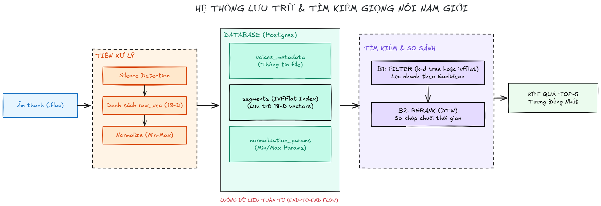

```sql
-- tạo 1 csdl mới
CREATE DATABASE mmdb;


-- vào trang github của pgvector để xem hướng dẫn tải cho window
-- link: https://github.com/pgvector/pgvector 
CREATE EXTENSION IF NOT EXISTS vector;


-- table lưu metadata của 1 file audio (.flac)
-- prefix là đường dẫn tuyệt đối đến thư mục voice-male-file
CREATE TABLE voices_metadata (
    file_id          SERIAL PRIMARY KEY,
    file_name        TEXT        NOT NULL,
    file_path        TEXT        NOT NULL UNIQUE,   -- prefix + "\" + audio_file
    speaker_name     TEXT,
    file_size_bytes  BIGINT,                       
    word_count       INT,
    duration_seconds FLOAT,
    created_at       TIMESTAMPTZ DEFAULT NOW()     
);


-- table lưu vector của phân đoạn file 
CREATE TABLE segments (
    segment_id      SERIAL PRIMARY KEY,
    file_id         INT         NOT NULL REFERENCES voices_metadata(file_id) ON DELETE CASCADE,
    segment_index   INT         NOT NULL,           -- thứ tự phân đoạn (0, 1, 2, ...) → BẮT BUỘC cho DTW
    start_time      FLOAT       NOT NULL,          
    end_time        FLOAT       NOT NULL,          
    raw_vec         VECTOR(18)  NOT NULL,           
    minmax_vec      VECTOR(18)  NOT NULL,          
    CONSTRAINT uq_file_segment UNIQUE (file_id, segment_index)  -- tránh duplicate
);


-- index để thực hiện truy vấn nhanh hơn
CREATE INDEX idx_seg_file_id ON segments (file_id);
CREATE INDEX idx_seg_file_segment ON segments (file_id, segment_index);

-- table lưu trữ giá trị min, max để thực hiện chuẩn hóa cho vector của file đầu vào sau này
CREATE TABLE normalization_params (
    param_name   TEXT PRIMARY KEY,   -- 'minmax_min' | 'minmax_max'
    param_vector VECTOR(18) NOT NULL
);
```
# Voice Similarity Search with Segmentation + DTW

Hệ thống tìm kiếm giọng nói nam dựa trên phân đoạn âm thanh và so khớp chuỗi bằng DTW.

## 📁 Cấu trúc thư mục dự kiến

```
M-csdl-DPT/v2/
|
├── voice-male-file/           # Thư mục chứa toàn bộ file .flac
├── metadata.csv               # File CSV metadata gốc
├── insert.py                  # Script tạo file CSV sạch và hướng dẫn import
├── indexer.py                 # Script trích xuất đặc trưng & xây dựng chỉ mục
├── app.py                     # Web server Flask
├── config.py                  # Cấu hình hệ thống
├── db.py                      # Kết nối PostgreSQL
├── extractor.py               # Xử lý âm thanh
├── normalizer.py              # Chuẩn hóa vector
├── search.py                  # Logic tìm kiếm & DTW
├── requirements.txt           # Thư viện Python
└── templates/
    └── index.html             # Giao diện Web
```

## 🚀 Hướng dẫn chạy nhanh

### 1. Cài đặt thư viện

```bash
pip install -r requirements.txt
```

### 2. Chuẩn bị dữ liệu

- Đặt tất cả file `.flac` vào thư mục `voice-male-file`.
- Đặt file `metadata.csv` cùng cấp với thư mục `voice-male-file`.

### 3. Import metadata vào PostgreSQL

Chạy script `insert.py` để tạo file CSV sạch và nhận câu lệnh `\copy`:

```bash
python insert.py
```

`Lưu ý`: Script sẽ cần update biến `PREFIX` **đường dẫn tuyệt đối** tới thư mục `voice-male-file`.  
Ví dụ: `D:/Downloads/voice-male-file`

Sau khi chạy, bạn sẽ nhận được:

- File `metadata_clean.csv` được tạo ra.
- Thực hiện câu lệnh sau để chèn data vào bảng `voices_metadata`

Mở **psql** hoặc **pgAdmin**, kết nối tới database của bạn, và chạy câu lệnh đó để import dữ liệu vào bảng `voices_metadata`.

Ví dụ:
```sql
\copy voices_metadata(file_name,file_path,speaker_name,file_size_bytes,word_count,duration_seconds) FROM 'D:/Downloads/metadata_clean.csv' DELIMITER ',' CSV HEADER;
```

### 4. Cấu hình kết nối PostgreSQL

Mở file `config.py` và chỉnh sửa thông tin database cho đúng:

```python
DB_CONFIG = {
    "host": "localhost",
    "port": 5432,
    "dbname": "mmdb",
    "user": "postgres",
    "password": "your_password",
}
```

### 5. Chạy indexing (trích xuất đặc trưng và xây dựng chỉ mục)
- Lưu ý cái này chạy lâu

```bash
python indexer.py
```

Quá trình này sẽ:

- Phân đoạn tất cả file `.flac` thành các segment nhỏ (dựa trên khoảng lặng).
- Trích xuất vector đặc trưng 18 chiều cho mỗi segment.
- Chuẩn hóa Min‑Max và lưu vào bảng `segments`.
- Tạo chỉ mục IVFFlat trong PostgreSQL.
- Xây dựng cây KD‑Tree và lưu ra file `kdtree_segments_minmax.pkl`.

> ⏳ Quá trình này mất khoảng 5–10 phút với 1329 file. Chỉ cần chạy **một lần duy nhất**.

### 6. Khởi động Web server

```bash
python app.py
```

Truy cập `http://localhost:5000`.  
Upload một file `.flac` bất kỳ, chọn engine (IVFFlat hoặc KD‑Tree) và nhận **Top 5 file có giọng nam tương tự nhất**.

## ❓ Giải thích nhanh

- **`insert.py`**: tạo file CSV sạch (chứa đầy đủ đường dẫn tuyệt đối) để import vào PostgreSQL.
- **`indexer.py`**: làm **tất cả** các bước tiền xử lý – trích xuất đặc trưng, chuẩn hóa, tạo chỉ mục. Sau khi chạy xong, hệ thống đã sẵn sàng tìm kiếm.
- **`app.py`**: Web server cho phép người dùng upload file và nhận kết quả tìm kiếm theo thời gian thực.

## 📝 Ghi chú

- File âm thanh nên là `.flac` (có thể hỗ trợ `.wav`, `.mp3` nếu cài đặt thêm codec).
- Nếu muốn chạy lại toàn bộ indexing (ví dụ thêm file mới), xóa bảng `segments` và chạy lại `indexer.py`.
- Mặc định hệ thống sử dụng **Euclidean distance** cho cả IVFFlat và KD‑Tree, phù hợp với dữ liệu âm thanh.